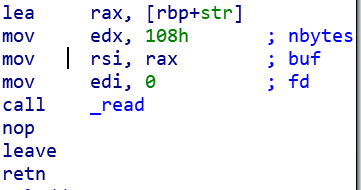

# 小总结

## 反编译 & 运行

IDA反编译程序，浏览程序内函数，运行程序，对照反编译，查看程序逻辑，了解程序流程，找出漏洞类型，编写exp

## 寻找漏洞点

### 关注危险函数 

#### 溢出

没有长度控制，可能产生溢出`gets` `scanf` `strcpy` `sprintf`

格式化字符串 `printf` `sprintf`

可能存在溢出`read` `fgets`

执行命令 `system` `exec*` 

#### 可能有用的函数

可能用于泄露内存 `puts` `write`

#### 一些特殊函数

映射一段内存 `mmap`

用于改变页权限`mprotect`

用于限制系统调用`ptctl` `seccomp相关`

#### 动态内存分配（堆相关）

`malloc` `free`

### 寻找逻辑漏洞

使用危险函数导致溢出

指定长度长于实际长度溢出

格式化字符串可控

## 编写exp

难以取得已知地址的RWX内存（ASLR & NX） => ROP

基于栈溢出：确定填充长度，构造ROP链

溢出不够长：栈迁移：`leave; ret; leave; ret;`

栈上保存的基指针覆盖为迁移的地址，迁移的地址上填充一个伪造的栈帧，这样能够增大ROP链的空间

### 寻找gadgets

构思函数调用链，最终执行`/bin/sh`，需要找gadgets `ROPgadget` & `ropper` 

#### 程序的代码段

64位下调用函数需要控制寄存器。没有打开PIE时，程序里的gadgets都可用，开启PIE时，需要先泄露加载地址再使用

程序内包含的常用的gadgets：

```asm
pop rdi ; ret
pop rsi ; pop r15 ; ret
```

[ret2csu](https://ctf-wiki.github.io/ctf-wiki/pwn/linux/stackoverflow/medium-rop-zh/#ret2csu): 64位下用于调用三参数函数（可控制rdi rsi rdx），缺点：需要的溢出长度比较大

text中可能有一些可以直接用的片段，例：



#### 过程链接表PLT

plt中有的函数，可以跳到PLT中对应的地址，可以直接执行对应的函数

#### 泄露libc

可以调用plt中没有的函数，可以调用one_gadget，也可以获取大量gadgets

题目中给了libc文件下载，一般说明本题需要泄露libc地址来获得函数

泄露地址常见从GOT中泄露，注意函数一定是已经调用过一次的，否则泄露的地址实际指向的是plt（回顾PLT的工作原理）

坑：`str*` `mem*` 这些函数比较[特殊](https://jasoncc.github.io/gnu_gcc_glibc/gnu-ifunc.html)，可能会导致计算失败

技巧：基地址最后12位一定是0，形如`0xffabc000`

PIE的程序也是可以这样泄露其中某个地址，来计算基地址的

#### 返回main/返回漏洞函数

某些题目可以反复返回到漏洞函数，重复利用漏洞

### 篡改全局偏移表GOT

在程序为Partial RELRO（Partial Relocation Read Only）时，.got.plt可以写入，篡改此处可以把函数篡改掉，比如把strcmp的GOT项改成system的地址，那么调用`strcmp(str1, str2)`时实际调用的是`system(str1)`

利用延迟绑定机制的还有`ret2_dl_runtime_resolve`技巧（还没讲可以参考[这里](https://ctf-wiki.github.io/ctf-wiki/pwn/linux/stackoverflow/advanced-rop-zh/#ret2_dl_runtime_resolve)）

### 格式化字符串

实现任意地址读 任意地址写

修改栈，同ROP，修改GOT，见上

### 一些技巧

利用`gdb.debug()`来调试，相当于process()，但是进程启动时会同时启动gdb开始调试，也可以添加一些gdbscripts

wsl下不能直接弹出gdb调试，可以用wsl-terminal

`LD_PRELOAD`可以用于加载非系统libc，不同版本的libc行为可能不一样

#### docker

利用docker以获得与目标服务器相同的环境

#### 新版libc

64位下较新的libc中有很多函数要求调用时栈对齐到16字节，否则会崩溃，此时可以补一个空的ret对齐栈